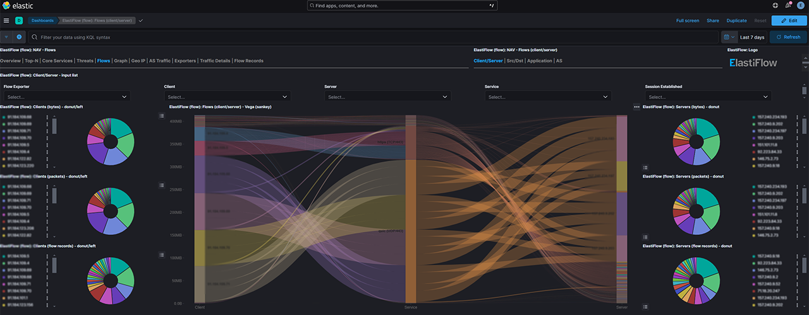
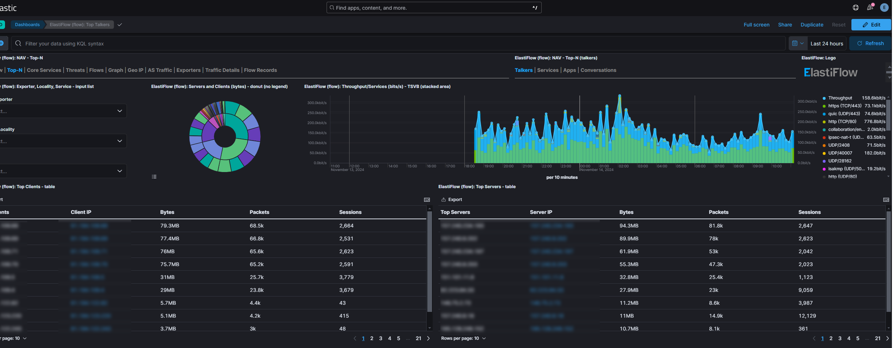

# NetFlow Collector Installation
The NetFlow Collector is built using the Elastic Stack, which includes Elasticsearch, Kibana, and the Elastiflow Flow Collector. Before you can install and configure the NetFlow Collector, you need to have a functioning Elastic Stack environment in place.

## Requirements
It's important to keep in mind that in production environments, the volume of data generated by multiple network flow sources can be substantial. Core routers or firewalls can generate thousands of flow records per second, which is not uncommon.

In my experience, many people underestimate the amount of flow data their networks will produce. To avoid potential issues, it's wise not to start with too small a setup. Use the following table as a guide to ensure you're adequately prepared:

flows/sec | (v)CPUs | Memory | Disk (30-days) | ES JVM Heap | LS JVM Heap
---:|---:|---:|---:|---:|---:
250 | 4 | 32 GB | 512 GB | 12 GB | 4 GB
500 | 6 | 48 GB | 1 TB | 16 GB | 4 GB
1000 | 8 | 64 GB | 2 TB | 24 GB | 6 GB
1500 | 12 | 96 GB | 3 TB | 31 GB | 6 GB

## Setting up NetFlow Collector using Docker
The easiest way to get everything up and running quickly is to use Docker and Docker Compose. The following instructions will walk you through setting up a single-node installation of NetFlow Collector on Docker.

NOTE: These instructions assume that you will have a server available with a recent Linux distribution and both docker and docker-composer installed.

## Prepare the Data Path
Data stored within a container's file system is ephemeral, meaning it will be lost when the container is removed. To ensure data persistence, you need to write the data to the local host's file system using a bind mount. You have to create a path on the host and set the necessary permissions for the processes within the container to write to it.
```
sudo mkdir /var/lib/netflow_es
sudo chown -R 1000:1000 /var/lib/netflow_es
sudo chown -R 1000:1000 ./ssl
```

## Add max_map_count to sysctl.conf
```
echo 'vm.max_map_count = 262144' | sudo tee -a /etc/sysctl.conf sudo sysctl -p
```

## Certificate Generation
Run bash script from ssl directory:
```bash
cd ssl
 ./generate_certs.sh
```
>[optional] You can change the subject line: 
```
-subj "/C=US/ST=SomeState/L=SomeCity/O=ExampleOrg/OU=ExampleUnit/CN=example.com"
```

## Docker compose file
```yaml
services:
  es_master1:
    image: docker.io/lsopromadze/netflow-elasticsearch    
    restart: unless-stopped
    hostname: es_master1
    ulimits:
      memlock:
        soft: -1
        hard: -1
      nofile:
        soft: 131072
        hard: 131072
      nproc: 8192
      fsize: -1
    network_mode: host
    volumes:
      - /var/lib/netflow_es:/usr/share/elasticsearch/data   
      - ./ssl:/usr/share/elasticsearch/config/certificates
    environment:
      ES_JAVA_OPTS: '-Xms12g -Xmx12g'
      cluster.name: elastiflow
      node.name: es_master1
      bootstrap.memory_lock: 'true'
      network.bind_host: '0.0.0.0'
      http.port: 9200
      http.publish_port: 9200
      transport.port: 9300
      transport.publish_port: 9300
      cluster.initial_master_nodes: 'es_master1'
      indices.query.bool.max_clause_count: 8192
      search.max_buckets: 250000
      action.destructive_requires_name: 'true'
      xpack.security.enabled: 'true'
      xpack.security.transport.ssl.enabled: 'true'
      xpack.security.authc.realms.file.file1.enabled: 'true'
      xpack.security.authc.realms.file.file1.order: '0' 
      xpack.security.transport.ssl.key: /usr/share/elasticsearch/config/certificates/transport.key
      xpack.security.transport.ssl.certificate: /usr/share/elasticsearch/config/certificates/transport.crt
      xpack.security.transport.ssl.certificate_authorities: /usr/share/elasticsearch/config/certificates/ca.crt

  kibana:
    image: docker.io/lsopromadze/netflow-kibana
    restart: unless-stopped
    hostname: NODE_NAME
    network_mode: host
    ports:
      - 5601:5601/tcp
    environment:
      TELEMETRY_OPTIN: 'false'
      TELEMETRY_ENABLED: 'false'
      SERVER_NAME: 'NODE_NAME'
      SERVER_HOST: '0.0.0.0'
      SERVER_PORT: 5601
      SERVER_MAXPAYLOADBYTES: 8388608
      ELASTICSEARCH_HOSTS: 'http://localhost:9200'
      ELASTICSEARCH_REQUESTTIMEOUT: 132000
      ELASTICSEARCH_SHARDTIMEOUT: 120000
      ELASTICSEARCH_SSL_VERIFICATIONMODE: 'none'
      KIBANA_AUTOCOMPLETETIMEOUT: 3000
      KIBANA_AUTOCOMPLETETERMINATEAFTER: 2500000
      VIS_TYPE_VEGA_ENABLEEXTERNALURLS: 'true'
      XPACK_MAPS_SHOWMAPVISUALIZATIONTYPES: 'true'
      XPACK_ENCRYPTEDSAVEDOBJECTS_ENCRYPTIONKEY: 'ElastiFlow_0123456789_0123456789_0123456789'
      xpack.security.enabled: 'true'
      ELASTICSEARCH_USERNAME: 'kibana_system'
      ELASTICSEARCH_PASSWORD: '<CHANGE>'
  
  flow-collector:
    image: docker.io/lsopromadze/netflow-flowcollector 
    container_name: flow-collector
    restart: 'unless-stopped'
    network_mode: 'host'
    volumes:
      - ./elastiflow:/etc/elastiflow
    environment:
      EF_LICENSE_ACCEPTED: 'true'
      LS_JAVA_OPTS: '-Xms12g -Xmx12g'
      EF_FLOW_SERVER_UDP_IP: '0.0.0.0'
      EF_FLOW_SERVER_UDP_PORT: 5678
      EF_PROCESSOR_DECODER_NETFLOW9_ENABLE: 'true'
      EF_PROCESSOR_DECODE_IPFIX_ENABLE: 'true'
      EF_PROCESSOR_ENRICH_IPADDR_METADATA_ENABLE: 'false'
      EF_PROCESSOR_ENRICH_DNS_ENABLE: 'false'
      EF_PROCESSOR_ENRICH_DNS_NAMESERVER_IP: ''
      EF_PROCESSOR_ENRICH_DNS_NAMESERVER_TIMEOUT: 3000
      EF_PROCESSOR_ENRICH_MAXMIND_ASN_ENABLE: 'true'
      EF_PROCESSOR_ENRICH_MAXMIND_ASN_PATH: '/etc/elastiflow/GeoLite2-ASN.mmdb'
      EF_PROCESSOR_ENRICH_MAXMIND_GEOIP_ENABLE: 'true'
      EF_PROCESSOR_ENRICH_MAXMIND_GEOIP_PATH: '/etc/elastiflow/GeoLite2-City.mmdb'
      EF_PROCESSOR_ENRICH_JOIN_ASN: 'true'
      EF_PROCESSOR_ENRICH_JOIN_GEOIP: 'true'
      EF_OUTPUT_ELASTICSEARCH_ENABLE: 'true'
      EF_OUTPUT_ELASTICSEARCH_ECS_ENABLE: 'true'
      EF_OUTPUT_ELASTICSEARCH_TIMESTAMP_SOURCE: 'start'
      EF_OUTPUT_ELASTICSEARCH_INDEX_PERIOD: 'rollover'
      EF_OUTPUT_ELASTICSEARCH_INDEX_TEMPLATE_SHARDS: 1
      EF_OUTPUT_ELASTICSEARCH_INDEX_TEMPLATE_REPLICAS: 0
      EF_OUTPUT_ELASTICSEARCH_ADDRESSES: '127.0.0.1:9200'
      EF_OUTPUT_ELASTICSEARCH_PROTOCOL: 'https'
      EF_OUTPUT_ELASTICSEARCH_TLS_ENABLE: 'false'
      EF_OUTPUT_ELASTICSEARCH_TLS_SKIP_VERIFICATION: 'false'
      EF_OUTPUT_ELASTICSEARCH_TLS_CA_CERT_FILEPATH: ''
      EF_OUTPUT_ELASTICSEARCH_USERNAME: 'elastic'
      EF_OUTPUT_ELASTICSEARCH_PASSWORD: '<CHANGE>'
```

## Generating passwords:
>for the first time bootstrap use this command:
```bash
docker exec -it netflow-elastic bin/elasticsearch-setup-passwords auto  
```
>to change already configured password for users elastic and kibana_system:
```bash
docker exec -it netflow-elastic bin/elasticsearch-reset-password -u kibana_system
docker exec -it netflow-elastic bin/elasticsearch-reset-password -u elastic
```
you need to change the password in the docker-compose.yml file [<CHANGE>]

## Netflow collector port
Netflow collector is set to listen on the UDP port 5678

## Importing Kibana Dashboards
Administration -> Stack Management -> Kibana -> Saved Objects -> Import
``` 
filename: kibana-8.14.x-flow-ecs.ndjson
```

## Autostart on Linux with systemd (for an old docker-compose version):
>create /etc/systemd/system/docker-compose-app.service
```
[Unit]
Description=Docker Compose Application Service
Requires=docker.service
After=docker.service

[Service]
Type=oneshot
RemainAfterExit=yes
WorkingDirectory=/opt/netflowcollector-elk/ #CHANGE_TO_YOUR_DIRECTORY
ExecStart=/usr/local/bin/docker-compose up -d
ExecStop=/usr/local/bin/docker-compose down
TimeoutStartSec=0

[Install]
WantedBy=multi-user.target

```
> systemctl enable docker-compose-app


## Screens



## Network device configuration:
If you're interested in learning how to configure a network device to send NetFlow data, I recommend checking out this insightful article by my friend. He played a crucial role in helping me with assembly and testing.
https://ccie37726.blogspot.com/2022/02/howto-flexible-netflow-with-ios-xe.html
